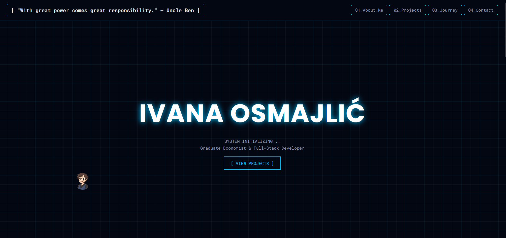

# Ivana Osmajlić - Digital Frontier Portfolio

Welcome to the source code of my personal portfolio website, designed with a "Digital Frontier" futuristic aesthetic. This is more than just a CV; it's an interactive digital experience built to showcase my skills, professional journey, and passion for technology and design.

**➡️ Live Version: [https://AlfaExelsior.github.io](https://AlfaExelsior.github.io)**

---

## 🚀 Core Features

This project was built from scratch with a focus on modern web technologies and a unique user experience.

*   **Futuristic "Digital Frontier" UI:** A design language inspired by sci-fi HUDs, featuring a grid-based layout, glowing neon accents, and sharp, clean lines.
*   **Context-Aware Avatar Cursor:** A custom-built cursor that changes its avatar based on the section of the site currently in view, reflecting my different professional roles (developer, scholar, business professional).
*   **Dynamic Trail Effect:** The avatar cursor leaves a "glitchy-particle" trail, enhancing the feeling of navigating a digital space.
*   **"Scan-in" Animations:** Elements don't just fade in. Using the `IntersectionObserver` API, UI cards and panels animate their corner brackets as you scroll, creating a "system loading" effect.
*   **Secure Contact Form:** The contact form is powered by Web3Forms and a custom JavaScript implementation. The Access Key is obfuscated using Base64 to prevent scraping by simple bots from this public repository.
*   **Fully Responsive:** The layout is optimized for a seamless experience on all devices, from desktop monitors to mobile phones.

---

## 🛠️ Tech Stack

This project is a testament to what can be achieved with the fundamentals of the web, without relying on heavy frameworks for the core functionality.

*   **`HTML5`**: For semantic and well-structured content.
*   **`CSS3`**: For styling and animations.
    *   **Flexbox & Grid:** For complex and responsive layouts.
    *   **Custom Properties (Variables):** For a maintainable and themeable design system.
    *   **Keyframe Animations:** For the cursor trail and "scan-in" effects.
*   **`Vanilla JavaScript (ES6+)`**: For all interactive logic.
    *   **DOM Manipulation:** To create dynamic elements like the cursor trail.
    *   **Intersection Observer API:** For efficient, performance-friendly scroll-triggered animations.
    *   **Fetch API:** For handling the asynchronous contact form submission.

---

## 📁 Project Structure

The repository is organized logically for clarity and maintainability.

/
├── index.html # Main HTML file
├── style.css # All styles for the project
├── script.js # All interactive logic
├── README.md # You are here!
├── Photo1.jpg # Main profile picture
└── avatar-*.png # The four custom avatars for the cursor

---

## 🔗 Connect with Me

Let's connect! I'm always open to new projects, collaborations, or just a chat about technology.

*   **LinkedIn:** [linkedin.com/in/ivana-osmajlic](https://www.linkedin.com/in/ivana-osmajlic/)
*   **GitHub:** [github.com/AlfaExelsior](https://github.com/AlfaExelsior)

---

## ✨ Acknowledgment

This project was an exciting challenge and a great learning experience. It reflects my philosophy: "With great power comes great responsibility" – a belief in building robust, beautiful, and thoughtful digital solutions.

Thank you for visiting!
